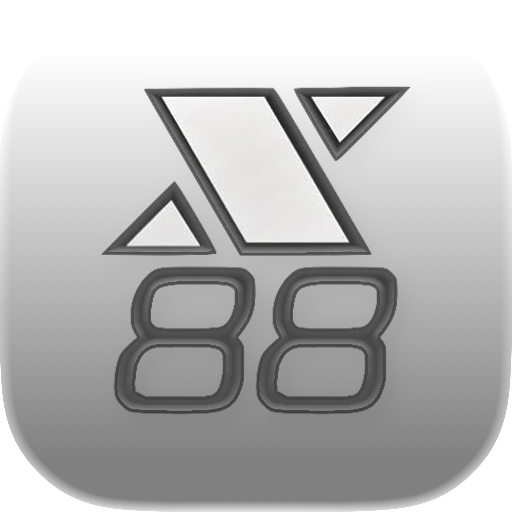
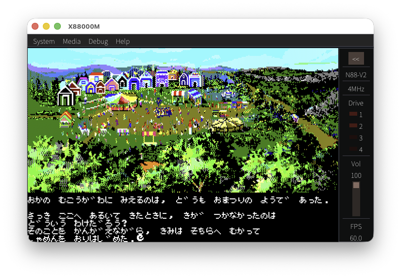
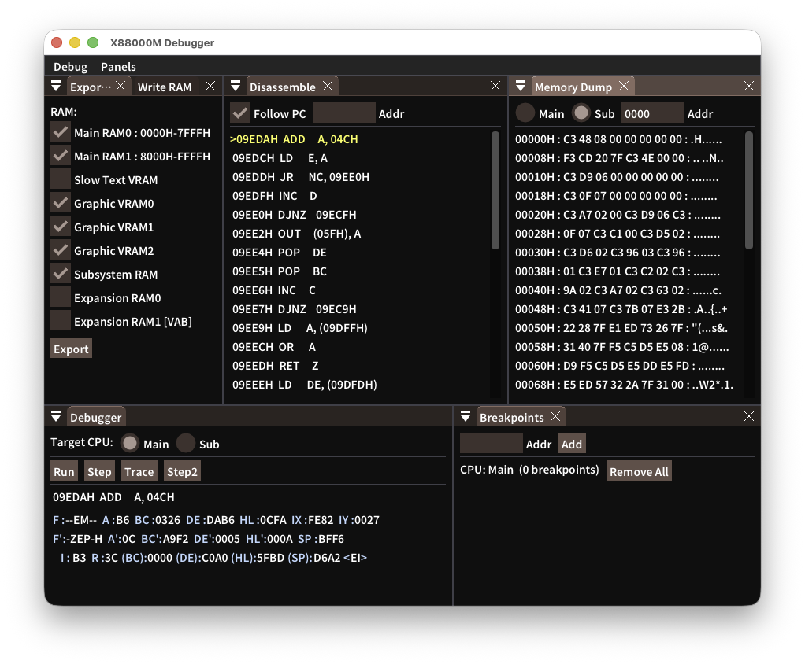

# X88000M

<p align="center">
  
</p>

X88000M は、Manuke 氏による PC-8801 エミュレータ `X88000` をベースにした macOS / Windows 向け移植版です。

<p align="center">
  <a href="https://github.com/bubio/X88000M/releases/latest">
    
  </a>
  <a href="https://github.com/bubio/X88000M/blob/main/LICENSE">
    
  </a>
  <a href="https://github.com/bubio/X88000M/actions/workflows/linux.yml">
    
  </a>
  <a href="https://github.com/bubio/X88000M/actions/workflows/macos.yml">
    
  </a>
  <a href="https://github.com/bubio/X88000M/actions/workflows/windows.yml">
    
  </a>
  <a href="https://github.com/bubio/X88000M/releases/latest">
    
  </a>
</p>


X88000のLinux版からGTK 2.0依存を排除し、SDL3 + Dear ImGuiで構築しています。

## About

<p align="center">
  
</p>

- **SDL3 + Dear ImGui ベースの単一 frontend**
  macOS / Windows で同じ操作感で利用できます。
- **メディア操作が速い**
  `D88`、`T88`、`CMT` をメニュー、ドラッグ&ドロップ、起動引数から読み込めます。
- **D88 の複数イメージ管理に対応**
  `Disk Manager` で D88 内のイメージを一覧し、Drive 1〜4 に割り当てできます。
- **普段使いに必要な機能を搭載**
  BASIC モード切り替え、4/8 MHz 切り替え、環境設定、スクリーンショット保存、画面テキストのコピー、テキスト貼り付け、プリンタプレビュー、フルスクリーンに対応しています。
- **YM2203 / YM2608に対応**
  YM2203 (OPN) に加え、YM2608 (OPNA / Sound Board II) の FM 6ch、リズム音源、ADPCM の初期実装に対応しています。
  Environment Settings の Sound board で `YM2203 / OPN`、`YM2608 / OPNA native`、`YM2203 + Sound Board II` を切り替えられます。
  FH/MH 以降の内蔵 OPNA 構成は `YM2608 / OPNA native`、SR/FR/MR などの YM2203 搭載機に Sound Board II を追加した構成は `YM2203 + Sound Board II` を選んでください。
- **デバッグ用途にも強い**
  別ウィンドウのデバッガ、逆アセンブル、メモリダンプ、ブレークポイント、RAM エクスポート、実行ログ記録を利用できます。

<p align="center">
  
</p>


## Features

- ROM 読み込みと実行
- `D88` の挿入・イジェクト
- `T88` / `CMT` の読み込みとテープ操作
- メディアファイルのドラッグ&ドロップ
- 起動引数 `--disk1=...` `--disk2=...` `--tape=...`
- `Disk Manager` / `Tape Manager`
- `Environment Settings`
- BEEP / PCG / OPNA の音声出力
- `Debug Window` / `Record Execution Log` / `Export RAM`
- スクリーンショット保存、クリップボード連携、プリンタプレビュー

## System Requirements

### macOS

- macOS 13.5 (Ventura) 以降
- Apple Silicon または Intel Mac

### Windows

- Windows 10 以降
- x64 または ARM64

### Linux

- Ubuntu 22.04 LTS 以降
- x86_64
- SDL3 の依存ライブラリ（alsa, pulseaudio, wayland, x11 等）

## Install

[Releases](https://github.com/bubio/X88000M/releases)ページから各 OS 用のパッケージをダウンロードしてください。

### Linux でのインストール

Ubuntu/Debian 系（`.deb`）:
```bash
sudo apt install ./X88000M-1.0.6-Linux.deb
```

Fedora/RHEL 系（`.rpm`）:
```bash
sudo dnf install ./X88000M-1.0.6-Linux.rpm
```

> **macOS での注意**: このアプリはAppleによるノータリゼーション（公証）を受けていないため、初回起動時にGatekeeperによってブロックされる場合があります。以下のいずれかの方法で回避できます：
>
> **方法1: ターミナルで隔離フラグを削除**
> ```bash
> xattr -cr /Applications/X88000M.app
> ```
>
> **方法2: システム設定から許可**
> 1. アプリを開こうとしてブロックされた後
> 2. 「システム設定」→「プライバシーとセキュリティ」を開く
> 3. 「"X88000M"は開発元を確認できないため、使用がブロックされました」の横にある「このまま開く」をクリック

## 使い始める前に

`X88000M` には ROM イメージは含まれていません。ROM 一式を次の場所に置いてください。

| OS | ROM 配置先 |
|---|---|
| macOS | `~/Library/Application Support/X88000M/` |
| Windows | `%APPDATA%\X88000M\` |
| Linux | `~/.local/share/X88000M/` |

端末から起動する場合はカレントディレクトリからも探します。必要に応じて `X88_ROM_DIR` 環境変数でも ROM ディレクトリを指定できます。

代表的に参照されるファイル名:

- `pc88.rom`
- `n88.rom`
- `n80.rom`
- `n88_0.rom`
- `n88_1.rom`
- `n88_2.rom`
- `n88_3.rom`
- `disk.rom`
- `kanji1.rom`
- `kanji2.rom`
- `font80sr.rom`
- `optfont.rom`

`pc88.rom` がある場合はそこからまとめて読み込み、無い場合は分割された ROM 名を順に探します。

## 基本操作

- `Media -> Open Media...` でディスクやテープを開けます。
- `D88` / `T88` / `CMT` をウィンドウへドラッグ&ドロップしても読み込めます。
- `System -> Environment Settings...` から BASIC モード、CPU クロック、ドライブ数、各種オプションを変更できます。
- `Debug -> Debug Window...` で別ウィンドウのデバッガを開けます。

よく使うショートカット:

- `Ctrl+O`: メディアを開く
- `Ctrl+R`: リセット
- `Ctrl+P`: 一時停止 / 再開
- `Ctrl+1` / `Ctrl+2`: Drive 1 / 2 をイジェクト
- `Ctrl+Enter`: フルスクリーン切り替え

ドラッグ&ドロップ時は `Shift+drop` で Drive 2、macOS では `Cmd+Ctrl+drop` で Drive 1 に優先投入できます。

## ソースからビルドする

### 必要なもの

- CMake 3.16 以上
- C++11 対応コンパイラ
  - macOS: Xcode (Apple Clang)
  - Windows: Visual Studio 2022 (MSVC)

SDL3 と Dear ImGui はデフォルトで自動取得されます (`X88000M_FETCH_SDL3=ON`, `X88000M_FETCH_IMGUI=ON`)。

### macOS

```sh
cmake -S . -B build -DCMAKE_BUILD_TYPE=Release
cmake --build build --target X88000M -j
```

`build/X88000M.app` が生成されます。

### Windows

Developer Command Prompt for VS 2022 から:

```cmd
cmake -S . -B build -G Ninja -DCMAKE_BUILD_TYPE=Release
cmake --build build --target X88000M --parallel
```

`build\X88000M.exe` と `build\fonts\` が生成されます。Ninja がない場合は Visual Studio ジェネレータも使えます:

```cmd
cmake -S . -B build -G "Visual Studio 17 2022" -A x64
```cmd
cmake --build build --config Release --target X88000M --parallel
```

### Linux

Ubuntu 22.04 以降:

```sh
# 依存ライブラリのインストール
sudo apt install build-essential cmake ninja-build pkg-config \
    libasound2-dev libpulse-dev libdbus-1-dev libudev-dev \
    libx11-dev libxcursor-dev libxext-dev libxi-dev \
    libxinerama-dev libxrandr-dev libxkbcommon-dev \
    libwayland-dev libegl1-mesa-dev libgl1-mesa-dev libpipewire-0.3-dev \
    libdecor-0-dev libxtst-dev libibus-1.0-dev libdrm-dev

# ビルド
cmake -S . -B build -G Ninja -DCMAKE_BUILD_TYPE=Release
cmake --build build --target X88000M --parallel
```

`build/X88000M` が生成されます。

## 現在の注意点

- ROM イメージは同梱していません。
- YM2203/YM2608 の実装はPDSライセンスを維持するためデータシートなど公式に得られる情報で作成しています。
- YM2608 リズム音源を使う場合は、ROM と同じ場所に `2608_BD.WAV`, `2608_SD.WAV`, `2608_TOP.WAV`, `2608_HH.WAV`, `2608_TOM.WAV`, `2608_RIM.WAV` を置いてください。
- オリジナルの Linux 版 / Windows 版と完全に同一の挙動を保証するものではありません。

## クレジット

- Original X88000 by Manuke
- macOS / Windows / SDL3+ImGui port maintained by bubio
- オリジナル配布物の説明文書は [src/X88000Src.txt](./src/X88000Src.txt) に収録しています。

## ライセンス

オリジナル配布物では、X88000 ソースは `PDS` (`Public Domain Software`) と表記されています。標準的な SPDX ライセンス識別子にそのまま対応するものではないため、このリポジトリでは upstream の文言を [LICENSE](./LICENSE) にそのまま収録しています。

### サードパーティ

本プロジェクトは以下のサードパーティソフトウェアを利用しています。ビルド時に自動取得され、静的リンクされます。

| ライブラリ | ライセンス | 用途 |
|---|---|---|
| [SDL3](https://github.com/libsdl-org/SDL) | zlib License | ウィンドウ、入力、オーディオ、レンダリング |
| [Dear ImGui](https://github.com/ocornut/imgui) | MIT License | GUI (メニュー、設定、デバッガ) |
| [Noto Sans JP](https://fonts.google.com/noto/specimen/Noto+Sans+JP) | SIL Open Font License 1.1 | 日本語フォント |

各ライセンスの詳細は以下を参照してください:

- SDL3: https://github.com/libsdl-org/SDL/blob/main/LICENSE.txt
- Dear ImGui: https://github.com/ocornut/imgui/blob/master/LICENSE.txt
- Noto Sans JP: [fonts/LICENSE-NotoSansJP.txt](./fonts/LICENSE-NotoSansJP.txt)

Noto Sans JP のライセンス文書は、フォント同梱先と同じディレクトリに同梱されます。

- macOS: `X88000M.app/Contents/Resources/fonts/LICENSE-NotoSansJP.txt`
- Windows: `fonts/LICENSE-NotoSansJP.txt`（配布 zip 内）
- Linux: `${CMAKE_INSTALL_DATADIR}/X88000M/fonts/LICENSE-NotoSansJP.txt`
